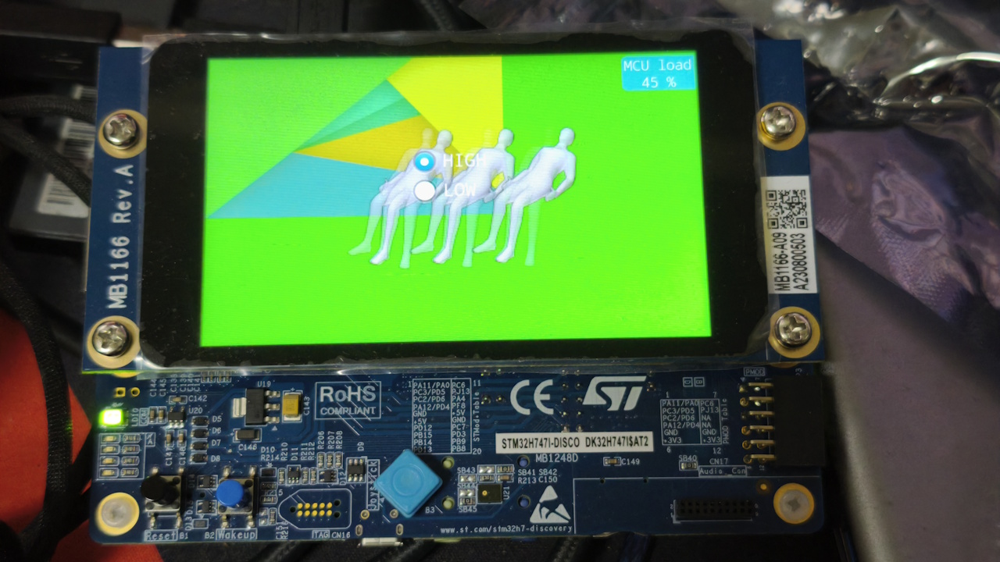
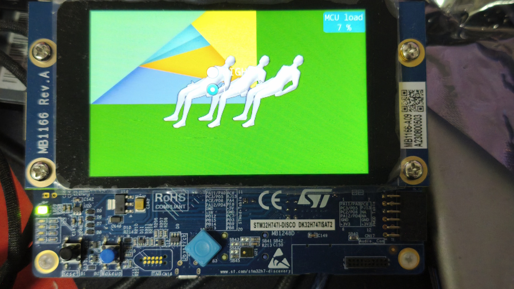
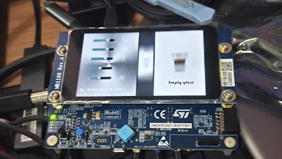
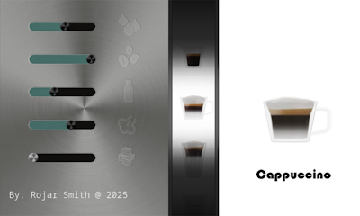
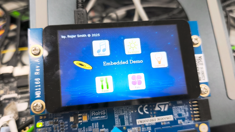
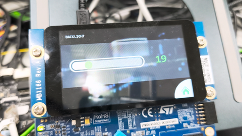
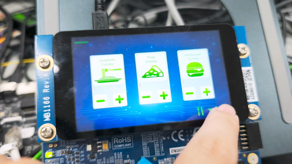
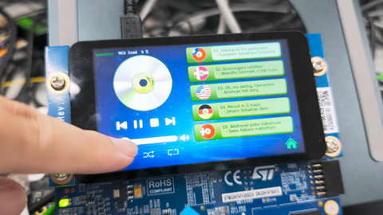
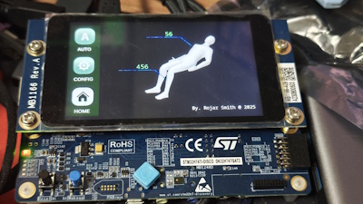
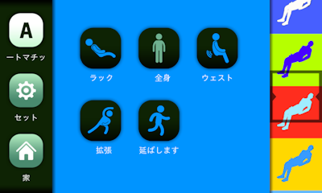

# STM32 Knight

Compile after change assets:

Delete build

## stm32-knight-freertos

FreeRTOS example.

```json
// .vscode/launch.json
"configurations": [{
        "executable": "${workspaceFolder}/build/cm7/build/stm32-knight-freertos-cm7.elf",
}]
```

```json
// CMakeUserPresets.json
{
    "version": 3,
    "configurePresets": [
        {
            "name": "local-debug",
            "inherits": "debug",
            "cacheVariables": {
                "CMAKE_BUILD_TYPE": "Debug",
                "BUILD_TARGET": "STM32H747I_DISCO",
                "BUILD_CONTEXT": "CM7",
                "FREERTOS_KERNEL_PATH": "../../../../stm32-knight-sdk/operatingsystem/FreeRTOS-LTS/FreeRTOS/FreeRTOS-Kernel"
            }
        }
    ]
}

```

## stm32-knight-iap

Modify `.vscode/launch.json`

```json
"executable": "${workspaceFolder}/build/cm7/build/stm32-knight-iap-cm7.elf",
// "executable": "${command:cmake.launchTargetPath}",
```

Rebuild:

Delete folder `build`→Modify `CMakeUserPresets.json`

```json
{
    "version": 3,
    "configurePresets": [
        {
            "name": "local-debug",
            "inherits": "debug",
            "cacheVariables": {
                "CMAKE_BUILD_TYPE": "Debug",
                "BUILD_TARGET": "STM32H747I_DISCO",
                // Type 1:
                "BUILD_CONTEXT": "CM7,BOOTLOADER",
                "BUILD_CONTEXT_S0": "CM7,APP_0"
            }
        }
    ]
}

// Type 2:
"BUILD_CONTEXT_S0": "CM7,BOOTLOADER",
"BUILD_CONTEXT": "CM7,APP_0"
// Type 3:
"BUILD_CONTEXT_S0": "CM7,BOOTLOADER",
"BUILD_CONTEXT": "CM7,APP_1"
```

→CMake→PROJECT OUTLINE Config All Projects

→stm32-knight-iap-cm7 Build→CMakeLists.txt Configure with CMake Debugger

## stm32-knight-iap-touchgfx

IAP + FreeRTOS + TouchGFX

`.vscode/launch.json`

```bash
"configurations":[
    {
        "name":"APP_0 Build & Debug Microcontroller - ST-Link",
        "cwd":"${workspaceFolder}",
        "type":"cortex-debug",
        "executable":"${workspaceFolder}/build/cm7/build/stm32-knight-touchgfx-ew2017-cm7.elf",
        "executable":"${command:cmake.launchTargetPath}",
        :"${command:cmake.launchTargetPath}":"${workspaceFolder}/path/to/filename.elf"
        "postLaunchCommands":[
            "monitor halt",
            "set $sp = *(uint32_t*)0x08040000",
            "set $pc = *(uint32_t*)0x08040004",
            "set *(uint32_t*)0xE000ED08 = 0x08040000",
            "break main",
            "continue"
        ],
        "request":"launch",
        "servertype":"stlink",
        "device":"STM32H747XIHx",
        "interface":"swd",
        "serialNumber":"",
        "runToEntryPoint":"main",
        "svdFile":"${config:STM32VSCodeExtension.cubeCLT.path}/STMicroelectronics_CMSIS_SVD/STM32H747_CM7.svd",
        "v1":false,
        "serverpath":"${config:STM32VSCodeExtension.cubeCLT.path}/STLink-gdb-server/bin/ST-LINK_gdbserver",
        "stm32cubeprogrammer":"${config:STM32VSCodeExtension.cubeCLT.path}/STM32CubeProgrammer/bin",
        "stlinkPath":"${config:STM32VSCodeExtension.cubeCLT.path}/STLink-gdb-server/bin/ST-LINK_gdbserver",
        "armToolchainPath":"${config:STM32VSCodeExtension.cubeCLT.path}/GNU-tools-for-STM32/bin",
        "gdbPath":"${config:STM32VSCodeExtension.cubeCLT.path}/GNU-tools-for-STM32/bin/arm-none-eabi-gdb",
        "serverArgs":[
            "-m",
            "0"
        ]
    },
    {
        "name":"APP_1 Build & Debug Microcontroller - ST-Link",
        "cwd":"${workspaceFolder}",
        "type":"cortex-debug",
        "executable":"${workspaceFolder}/build/cm7/build/stm32-knight-touchgfx-ew2017-cm7.elf",
        "executable":"${command:cmake.launchTargetPath}",
        :"${command:cmake.launchTargetPath}":"${workspaceFolder}/path/to/filename.elf""postLaunchCommands":[
            "monitor halt",
            "set $sp = *(uint32_t*)0x080A0000",
            "set $pc = *(uint32_t*)0x080A0004",
            "set *(uint32_t*)0xE000ED08 = 0x080A0000",
            "break main",
            "continue"
        ],
        "request":"launch",
        "servertype":"stlink",
        "device":"STM32H747XIHx",
        "interface":"swd",
        "serialNumber":"",
        "runToEntryPoint":"main",
        "svdFile":"${config:STM32VSCodeExtension.cubeCLT.path}/STMicroelectronics_CMSIS_SVD/STM32H747_CM7.svd",
        "v1":false,
        "serverpath":"${config:STM32VSCodeExtension.cubeCLT.path}/STLink-gdb-server/bin/ST-LINK_gdbserver",
        "stm32cubeprogrammer":"${config:STM32VSCodeExtension.cubeCLT.path}/STM32CubeProgrammer/bin",
        "stlinkPath":"${config:STM32VSCodeExtension.cubeCLT.path}/STLink-gdb-server/bin/ST-LINK_gdbserver",
        "armToolchainPath":"${config:STM32VSCodeExtension.cubeCLT.path}/GNU-tools-for-STM32/bin",
        "gdbPath":"${config:STM32VSCodeExtension.cubeCLT.path}/GNU-tools-for-STM32/bin/arm-none-eabi-gdb",
        "serverArgs":[
            "-m",
            "0"
        ]
    },
]
```

## stm32-knight-ltdc

LTDC

## stm32-knight-template-minimal

Purpose:

Correctly set the MCU register to generate a delay of 10 seconds.

Feature:

- STM32CubeCLT
- CMake
- Multi-core
- Multi target board

STM32 VS Code Extension→Import CMake project→Board→Actions→Open in this window

Board:

- STM32F746G-DISCO
- STM32H747I-DISCO

Debug:

Project Outline→Configure with CMake Debugger→Select and Start Debug Configuration→Debug CM7 - ST-Link

Select Board:

Clean Project→Delete .vscode→Modfy CMakeUserPresets.json→STM32 VS Code Extension→Import CMake project

`CMakeUserPresets.json`

```json
{
    "version": 3,
    "configurePresets": [
        {
            "name": "local-debug",
            "inherits": "debug",
            "cacheVariables": {
                "CMAKE_BUILD_TYPE": "Debug",
                "BUILD_TARGET": "STM32H747I_DISCO",
                "BUILD_CONTEXT": "CM7"
            }
        }
    ]
}
```

```json
{
    "version": 3,
    "configurePresets": [
        {
            "name": "local-debug",
            "inherits": "default",
            "cacheVariables": {
                "CMAKE_BUILD_TYPE": "Debug",
                "BUILD_TARGET": "STM32F746G_DISCO"
            }
        }
    ],
    "buildPresets": [
        {
            "name": "local-debug",
            "configurePreset": "local-debug"
        }
    ]
}
```

Troubleshooting:

Q: Project Outline not correct.

A: Re-open the project.

Q: Can not close CMake Debugger in Call Stack.

A: Re-open the project or use `Reload Window` command at command panel.

Q: Debug STM32F746G-DISCO meet with `"executable": "${command:STM32VSCodeExtension.dualCoreTarget}"` not define.

A: Use new path `"executable": "${workspaceFolder}/build/stm32-knight-template-minimal-target.elf"` then ignore all wrong.

Q: Not find `Debug CM7 - ST-Link` ?

A: Import CMake project again.

Q: Not found binary ?

A: `.vscode/launch.json` modify:

```json
"configurations": [{
    "executable": "${workspaceFolder}/build/core0/build/stm32-knight-xxx-core0.elf",
}]
```

## stm32-knight-touchgfx-burn-test

TouchGFX stress test performance evaluation Demo uses 2~3 tasks and supports dynamic increase and decrease of tasks in the FreeRTOS background. Porting to STM32H747I Discovery at 2025.





## stm32-knight-touchgfx-charging-station

Not support compile with TouchGFX Designer

Original resolution: Portrait 1024x768 4:3

STM32H747I Discovery: Portrait 640x480 4:3

## stm32-knight-touchgfx-coffee-machine

Coffee machine GUI for 2017 Munich electronics show. Porting to STM32H747I Discovery at 2025.





## stm32-knight-touchgfx-ew2017

Video STM32 Demo : VSCode + STM32CubeCLT + IAP + FreeRTOS + TouchGFX

[](https://youtu.be/PzOW6UNdrQA)

<video width="640" height="360" controls>
 <source src="https://youtu.be/PzOW6UNdrQA" type="video" alt="STM32 Demo : VSCode + STM32CubeCLT + IAP + FreeRTOS + TouchGFX">
</video>

Using the latest STM32CubeCLT tool chain, the code is porting from the demo exhibited at Embedded World in 2017, and the copyright-restricted parts have been removed.

Features : VSCode + STM32CubeCLT + IAP + FreeRTOS + TouchGFX








Backlight not support PWM, only CABC 0~100, change brightness slowly.

Don't commit to git each time:

gui/TouchGFX/config/gcc/app.mk

gui/TouchGFX/config/msvs/Application.props

`gui/TouchGFX/config/gcc/app.mk`

```ini
# Relative location of the TouchGFX framework from root of application
touchgfx_path := ../../../stm32-knight-sdk/firmware/Middlewares/ST/TouchGFX/touchgfx

# Location of the TouchGFX Environment
touchgfx_env := ../../../../../../../TouchGFX/4.25.0/env
# Optional additional compiler flags
user_cflags := -DUSE_BPP=24
```

`gui/TouchGFX/config/msvs/Application.props`

```xml
<?xml version="1.0" encoding="utf-8"?>
<Project xmlns="http://schemas.microsoft.com/developer/msbuild/2003" ToolsVersion="4.0">
  <ImportGroup Label="PropertySheets"/>
  <PropertyGroup Label="UserMacros">
    <UseBPP>24</UseBPP>
    <TouchGFXReleasePath>..\..\..\..\..\stm32-knight-sdk\firmware\Middlewares\ST\TouchGFX\touchgfx</TouchGFXReleasePath>
    <TouchGFXEnvPath>..\..\..\..\..\..\..\..\..\TouchGFX\4.25.0\env</TouchGFXEnvPath>
    <ApplicationRoot>..\..</ApplicationRoot>
  </PropertyGroup>
  <PropertyGroup/>
  <ItemDefinitionGroup/>
  <ItemGroup>
    <BuildMacro Include="UseBPP">
      <Value>$(UseBPP)</Value>
    </BuildMacro>
    <BuildMacro Include="TouchGFXReleasePath">
      <Value>$(TouchGFXReleasePath)</Value>
    </BuildMacro>
    <BuildMacro Include="TouchGFXEnvPath">
      <Value>$(TouchGFXEnvPath)</Value>
    </BuildMacro>
    <BuildMacro Include="ApplicationRoot">
      <Value>$(ApplicationRoot)</Value>
    </BuildMacro>
  </ItemGroup>
</Project>

```

`.vscode/launch.json`

```json
"executable": "${command:STM32VSCodeExtension.dualCoreCM7Target}",
"serverArgs": [
    "-m", "0",
    "-t", "-s",
    "-k",
    "--extload", "c:\\ST\\STM32CubeCLT_1.18.0\\STM32CubeProgrammer\\bin\\ExternalLoader\\MT25TL01G_STM32H747I-DISCO.stldr",
],
```

`CMakeUserPresets.json`

```json
"configurePresets":[
    {
        "name":"local-debug-app-0",
        "inherits":"debug",
        "cacheVariables":{
            "BUILD_TARGET":"STM32H747I_DISCO",
            "BUILD_CONTEXT":"CM7,APP_0"
        }
    }
]
```

## stm32-knight-touchgfx-massage-chair

Real Japanese Massage Chair GUI Case Performance Evaluation. Porting to STM32H747I Discovery at 2025.





## utility

### freertos-win-example

`CMakeUserPresets.json`

```json
{
    "version": 3,
    "configurePresets": [
        {
            "name": "local-debug",
            "inherits": "debug",
            "cacheVariables": {
                "FREERTOS_KERNEL_PATH": "../../../operatingsystem/FreeRTOS-LTS/FreeRTOS/FreeRTOS-Kernel"
            }
        }
    ]
}
```

`.vscode/launch.json`

```json
{
    "version": "0.2.0",
    "configurations": [{
        "name": "Debug FreeRTOS Windows Simulation",
        "type": "cppvsdbg",
        "request": "launch",
        "program":"C:/my/Build/GitPublic/stm32-knight/stm32-knight-sdk/utility/freertos-win-example/out/build/local-debug/src/Debug/freertos-win-example.exe",
        // "program": "${workspaceFolder}/out/build/local-debug/src/Debug/freertos-win-example.exe",
        "args": [],
        "cwd": "${workspaceFolder}",
        "environment": [],
        "console": "externalTerminal",
        // for "type": "cppdbg",
        // "setupCommands": [
        //     { "description": "Enable non-stop mode", "text": "set non-stop on", "ignoreFailures": true },
        //     { "description": "Enable scheduler locking", "text": "set scheduler-locking on", "ignoreFailures": true }
        // ]
    }],

}
```

In debug mode and freezon at:

xWinApiResult = WaitForMultipleObjects( sizeof( pvObjectList ) / sizeof( void * ), pvObjectList, TRUE, xTimeoutMilliseconds );

Need correct `setupCommands` for `cppdbg`.

Run debug: Select and Strat Debug Configuration

## TouchGFX

Non TouchGFX Designer generated:

App/

target/

GUI.touchgfx

